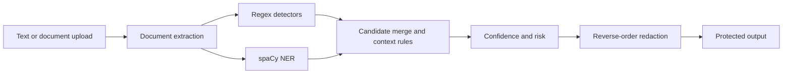

# Architecture

The detector boundary is pure and returns `Entity` metadata. No entity stores the matched text. Regex patterns are confidence-ranked and use contextual prefixes for ambiguous fields such as account numbers and dates of birth. Overlapping candidates are resolved by span overlap and confidence. Redaction consumes only the original text plus offsets and operates from the end of the document toward the beginning.
